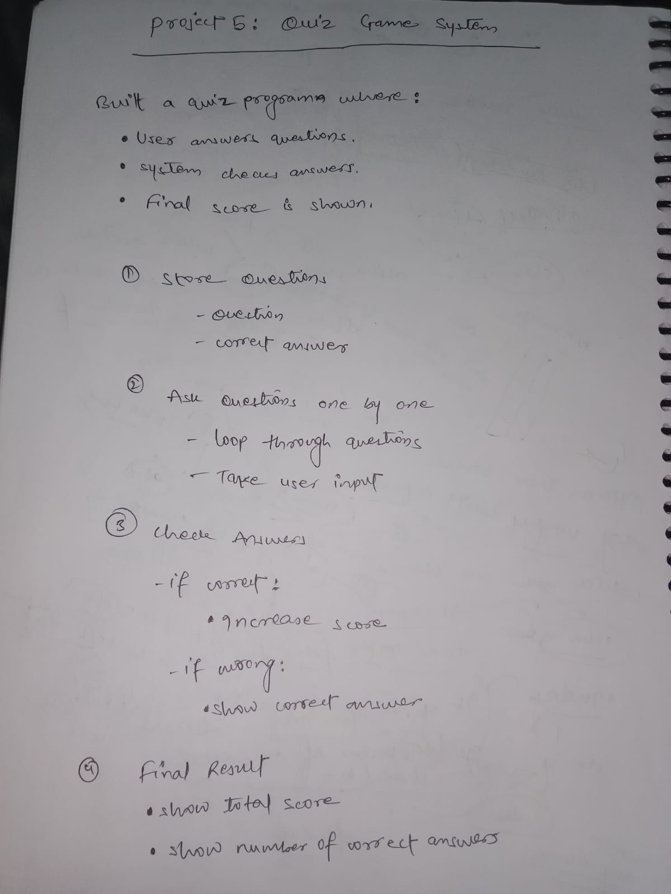

## Project 07-Quiz-Game
In this project,I have learned how to use dictionary data(key and value) type and for loop to use question one by one.
I have also used .values() built-in function to get direct value of the dictionary.

